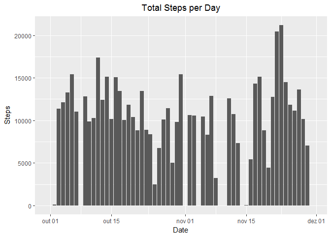
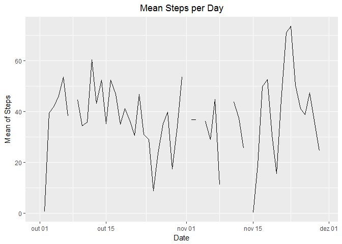

# Reproducible Research: Peer Assessment 1


```
## -------------------------------------------------------------------------
```

```
## data.table + dplyr code now lives in dtplyr.
## Please library(dtplyr)!
```

```
## -------------------------------------------------------------------------
```

```
## 
## Attaching package: 'dplyr'
```

```
## The following objects are masked from 'package:data.table':
## 
##     between, first, last
```

```
## The following objects are masked from 'package:stats':
## 
##     filter, lag
```

```
## The following objects are masked from 'package:base':
## 
##     intersect, setdiff, setequal, union
```
## Loading and preprocessing the data

```r
setwd("~/ScriptsR/RepData_PeerAssessment1")
Activity <- read.csv("activity.csv", sep = ",",
                       header = TRUE, na.strings = "NA")
Activity$date <- as.Date(Activity$date, "%Y-%m-%d")
dim(Activity)
```

```
## [1] 17568     3
```


## What is mean total number of steps taken per day?
  
Total steps per day:

```r
by_day_Activity1 <- group_by(Activity, date)
Activity_by_day1 <- as.data.frame(summarise(by_day_Activity1, sum.Steps.1 = sum(steps, na.rm = TRUE)))
g1<-ggplot(Activity_by_day1,aes(date, sum.Steps.1))
g1 + geom_bar(stat = "identity") + labs(y = "Steps") + labs(x = "Date") + 
    labs(title="Total Steps per Day")+theme(plot.title = element_text(hjust = 0.5))
```

<!-- -->
  
Mean and median steps per day:

```r
Activity_by_day2 <- group_by(Activity, date) %>% summarise(Mean.Steps = mean(steps, na.rm = TRUE), Median.Steps = median(steps, na.rm = TRUE))
Activity_by_day2 <- as.data.frame(Activity_by_day2)
Activity_by_day2
```

```
##          date Mean.Steps Median.Steps
## 1  2012-10-01        NaN           NA
## 2  2012-10-02  0.4375000            0
## 3  2012-10-03 39.4166667            0
## 4  2012-10-04 42.0694444            0
## 5  2012-10-05 46.1597222            0
## 6  2012-10-06 53.5416667            0
## 7  2012-10-07 38.2465278            0
## 8  2012-10-08        NaN           NA
## 9  2012-10-09 44.4826389            0
## 10 2012-10-10 34.3750000            0
## 11 2012-10-11 35.7777778            0
## 12 2012-10-12 60.3541667            0
## 13 2012-10-13 43.1458333            0
## 14 2012-10-14 52.4236111            0
## 15 2012-10-15 35.2048611            0
## 16 2012-10-16 52.3750000            0
## 17 2012-10-17 46.7083333            0
## 18 2012-10-18 34.9166667            0
## 19 2012-10-19 41.0729167            0
## 20 2012-10-20 36.0937500            0
## 21 2012-10-21 30.6284722            0
## 22 2012-10-22 46.7361111            0
## 23 2012-10-23 30.9652778            0
## 24 2012-10-24 29.0104167            0
## 25 2012-10-25  8.6527778            0
## 26 2012-10-26 23.5347222            0
## 27 2012-10-27 35.1354167            0
## 28 2012-10-28 39.7847222            0
## 29 2012-10-29 17.4236111            0
## 30 2012-10-30 34.0937500            0
## 31 2012-10-31 53.5208333            0
## 32 2012-11-01        NaN           NA
## 33 2012-11-02 36.8055556            0
## 34 2012-11-03 36.7048611            0
## 35 2012-11-04        NaN           NA
## 36 2012-11-05 36.2465278            0
## 37 2012-11-06 28.9375000            0
## 38 2012-11-07 44.7326389            0
## 39 2012-11-08 11.1770833            0
## 40 2012-11-09        NaN           NA
## 41 2012-11-10        NaN           NA
## 42 2012-11-11 43.7777778            0
## 43 2012-11-12 37.3784722            0
## 44 2012-11-13 25.4722222            0
## 45 2012-11-14        NaN           NA
## 46 2012-11-15  0.1423611            0
## 47 2012-11-16 18.8923611            0
## 48 2012-11-17 49.7881944            0
## 49 2012-11-18 52.4652778            0
## 50 2012-11-19 30.6979167            0
## 51 2012-11-20 15.5277778            0
## 52 2012-11-21 44.3993056            0
## 53 2012-11-22 70.9270833            0
## 54 2012-11-23 73.5902778            0
## 55 2012-11-24 50.2708333            0
## 56 2012-11-25 41.0902778            0
## 57 2012-11-26 38.7569444            0
## 58 2012-11-27 47.3819444            0
## 59 2012-11-28 35.3576389            0
## 60 2012-11-29 24.4687500            0
## 61 2012-11-30        NaN           NA
```
  
## What is the average daily activity pattern?
  
Mean steps per day:

```r
by_day_Activity3 <- group_by(Activity, date)
Activity_by_day3 <- as.data.frame(summarise(by_day_Activity3, Mean.Steps.3 = mean(steps, na.rm = TRUE)))
g2<-ggplot(Activity_by_day3,aes(date,Mean.Steps.3))
g2 + geom_line() + labs(y = "Mean of Steps") + labs(x = "Date") + 
    labs(title="Mean Steps per Day")+theme(plot.title = element_text(hjust = 0.5))
```

```
## Warning: Removed 2 rows containing missing values (geom_path).
```

<!-- -->
  
5-minute interval with maximum number of steps:  

```r
Activity4<-Activity
Activity4$interval <- as.factor(Activity4$interval)
Activity4_by_interval <- group_by(Activity4, interval) %>% summarise(Mean.Steps.4 = mean(steps, na.rm = TRUE))
Activity4_by_interval <- as.data.frame(Activity4_by_interval)
Activity4_by_interval <- filter(Activity4_by_interval, Mean.Steps.4 == max(Mean.Steps.4))
Activity4_by_interval
```

```
##   interval Mean.Steps.4
## 1      835     206.1698
```

## Imputing missing values

```r
StepsAct<-Activity$steps
summary(Activity$steps)
```

```
##    Min. 1st Qu.  Median    Mean 3rd Qu.    Max.    NA's 
##    0.00    0.00    0.00   37.38   12.00  806.00    2304
```

```r
summary(StepsAct)
```

```
##    Min. 1st Qu.  Median    Mean 3rd Qu.    Max.    NA's 
##    0.00    0.00    0.00   37.38   12.00  806.00    2304
```

```r
mean(is.na(StepsAct))
```

```
## [1] 0.1311475
```


## Are there differences in activity patterns between weekdays and weekends?
